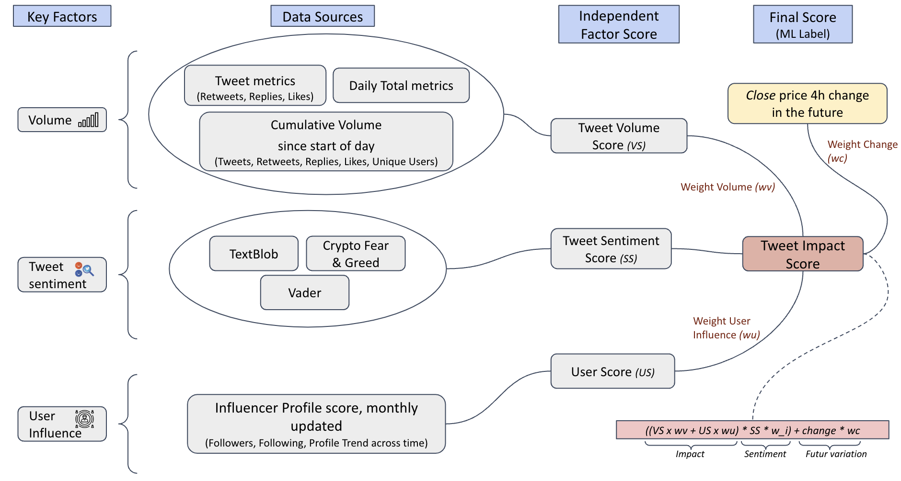

# OCEAN Token Sentiment Analysis Challenge - Part II

This comprehensive repository presents a novel approach to understanding the dynamics between Twitter engagement and OCEAN token price fluctuations. It introduces the innovative Impact Score, a predictive metric reflecting tweet volume, sentiment, user influence, and future price variation. The report delves into an advanced machine learning model, explores the challenges faced, and offers invaluable actionable insights.

### Approach Impact Sentiment score (Indicator & ML Target)

### Ocean Market
Report - https://market.oceanprotocol.com/asset/did:op:41b30a08947215853cc160558c62c61a829764b9ebfc316fda96ca071f9ac889

# (Deprecated) OCEAN Token Sentiment Analysis Challenge - Part I

This repository presents an in-depth analysis of the relationship between Twitter sentiment and the price of the OCEAN token, using extensive data from tweets and market prices. It features a comprehensive exploration of correlations between various Twitter engagement metrics and $OCEAN's price. The repository further unveils a dual-model predictive approach employing XGBoost for tabular data and a fine-tuned DistilBERT model for textual data. The culmination is an ensemble model adept at sentiment classification. This repository provides valuable insights into the role of social media sentiment in cryptocurrency market dynamics, offering a valuable tool for data-driven investment strategies. 

### Ocean Market
Report - https://market.oceanprotocol.com/asset/did:op:df20b784fd8fbbc96834645fb9d49670e35fd708228d7c791787292fc1a79ffb

